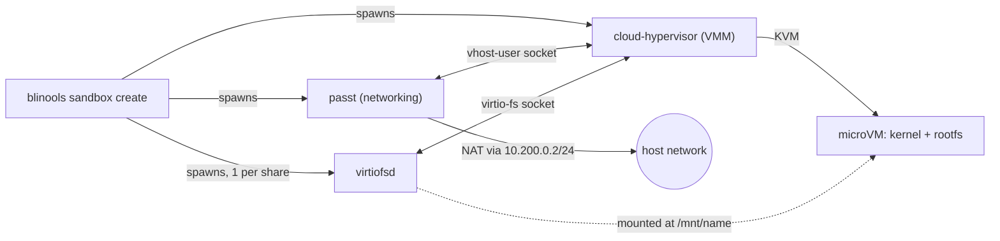

# blinxen's tools

A collection of my various bash scripts converted into a Rust CLI (Linux only).

## Commands

| Command | Description |
| --- | --- |
| [`blinools wip-pr`](#blinools-wip-pr) | 🚧 TODO |
| [`blinools sandbox`](#blinools-sandbox) | Create and manage sandboxes |
| [`blinools completions`](#shell-completions) | Generate shell completion scripts |

## Installation

### Prebuilt binaries

Tagged releases are built for `x86_64-unknown-linux-gnu` and `aarch64-unknown-linux-gnu`.
Grab the archive for your architecture from the [Releases](../../releases) page,
then verify and unpack it:

```bash
sha256sum -c SHA256SUMS
tar xzf blinools-<version>-<target>.tar.gz
```

### Build from source

```bash
git clone https://github.com/blinxen/blinools.git
cd blinools
cargo install --path .
```

This installs the `blinools` binary to `~/.cargo/bin`.

### Shell completions

`blinools completions` supports `bash`, `elvish`, `fish`, `powershell` and `zsh`:

```bash
# Bash
blinools completions bash > ~/.local/share/bash-completion/completions/blinools

# Zsh
blinools completions zsh > "${fpath[1]}/_blinools"

# Fish
blinools completions fish > ~/.config/fish/completions/blinools.fish
```

## Configuration reference

The configuration file uses the TOML format and can be configured using:

- a global configuration file located at `$XDG_CONFIG_HOME/blinools/blinools.toml` or `$HOME/.config/blinools/blinools.toml` if `$XDG_CONFIG_HOME` is not defined
- the `-c`/`--config` flag, available on every command, which defaults to `./blinools.toml`

```bash
blinools --config ./my-sandbox.toml sandbox create
```

The order in which they are loaded is global → `--config` flag. The flag file
overrides whatever was defined in the global configuration file.

Currently the only config section is `[sandbox]`, used by the [`sandbox`](#blinools-sandbox) command:

| Key | Type | Required | Default | Notes |
| --- | --- | --- | --- | --- |
| `name` | string | No | Sandbox name to use, if not defined then the current directory name is used. If that somehow also does not work a random 16 character name is generated. | Overridden by the `[NAME]` argument to `sandbox create` |
| `kernel` | path | **Yes** | - | - |
| `kernel_cmdline` | string | No | `""` | Must not contain `console=` or `root=` (already set for you, see [How it works](#how-it-works)) |
| `rootfs` | path | **Yes** | - | Treated as a read-only base image |
| `rootfs_type` | `"Raw"` \| `"QCOW2"` | No | `"Raw"` | Format of the file at `rootfs` |
| `memory_mb` | integer | **Yes** | - | Accepted range is 512 – 131072 (0.5 – 128 GiB) |
| `cpus` | integer | **Yes** | - | Accepted range is 1 – 255 |
| `dns` | array of strings | No | - | DNS server IPs to use inside the guest |
| `shares` | array of tables | No | - | Can also be set / overridden per-run with `--share`, see [`sandbox create`](#sandbox-create) |
| `shares[].name` | string | **Yes** | - | ASCII only. Used as the guest mount point `/mnt/<name>` |
| `shares[].host_dir` | path | **Yes** | - | - |
| `shares[].read_only` | bool | No | `false` | |
| `cloud_hypervisor.binary` | path | No | Resolved from `$PATH` as `cloud-hypervisor` | |
| `passt.binary` | path | No | Resolved from `$PATH` as `passt` | |
| `virtiofsd.binary` | path | No | Resolved from `$PATH` as `virtiofsd` | |

```toml
[sandbox]
# Optional custom paths to the binary files
cloud_hypervisor.cloud_hypervisor_binary = "/path/to/cloud-hypervisor"
passt.binary = "/path/to/passt"
virtiofsd.binary = "/path/to/virtiofsd"
# Path to the kernel
kernel = "/boot/vmlinuz-7.1.10-200.fc44.x86_64"
# Kernel command line parameters to pass
# "console" and "root" must not be configured here
# They are hardcoded to "console=hvc0 root=/dev/vda" for now
kernel_cmdline = "rw quiet"
# Path to the rootfs
rootfs = "./rootfs.img"
# How much memory the VM should have in megabytes
memory_mb = 8192
# How many cores the VM should have
cpus = 4
# Optional list of DNS servers to use in the VM
dns = ["192.168.1.1"]
# Optional paths to automatically mount under /mnt when the VM is started
# Can also be defined with the --share flag, see blinools sandbox create --help
shares = [
    { name = "share-name", host_dir = "/path/to/a/directory", read_only = false },
]
```

## `blinools wip-pr`

> [!WARNING]
> **TODO**: not implemented yet. The command is wired up and accepts the
> arguments below, but currently does nothing.

### CLI reference

```bash
blinools wip-pr <BRANCH_NAME> [-t|--branch-type <TYPE>] [-n|--task-number <NUM>]
```

| Argument | Required | Default | Description |
| --- | --- | --- | --- |
| `<BRANCH_NAME>` | **Yes** | - | Branch name |
| `-t, --branch-type <TYPE>` | No | none | Branch type |
| `-n, --task-number <NUM>`| No | none | Task number |

## `blinools sandbox`

> [!WARNING]
> This is still under heavy development and still contains rough edges.

Manage sandboxes. The `sandbox` subcommand was initially created for isolating
AI harnesses, but it can be used for anything.

Every `sandbox` subcommand requires a `[sandbox]` table in your resolved
configuration. Also see [Configuration reference](#configuration-reference).

### Requirements

- [Cloud Hypervisor](https://github.com/cloud-hypervisor/cloud-hypervisor) is used for creating microVMs.
- [passt](https://passt.top) is used to enable networking.
- [virtiofsd](https://gitlab.com/virtio-fs/virtiofsd) is used for sharing directories with the microVM.
- Hardware virtualization (KVM) enabled, with access to `/dev/kvm` (e.g. your user is a member of the `kvm` group).

Fedora:

```bash
# virtiofsd is installed under /usr/libexec by default, I recommend configuring "virtiofsd.binary" in the config file.
sudo dnf install passt virtiofsd
```

Cloud Hypervisor is not packaged in most distributions, you can either
[download a pre-built binary](https://www.cloudhypervisor.org/docs/prologue/quick-start/#use-pre-built-binaries)
or
[build it from source](https://www.cloudhypervisor.org/docs/prologue/quick-start/#building-from-source).

## Quick start

To create a sandbox, you will need a compiled Linux kernel and a rootfs.
You don't *have* to actually compile your own kernel, you can just use whatever
your distro provides. The example configuration below uses the official Fedora 44 kernel.
The rootfs can also be easily created using `podman` (or `docker`).
Check out the [examples](./examples) directory. The example builds a minimal Fedora
kernel + rootfs pair with `examples/fedora/Dockerfile` and
`examples/fedora/build-rootfs.sh`.

The next steps assume you already have a compiled Linux kernel and a built rootfs.
See [Configuration reference](#configuration-reference) below for the full list of options.

1. Create a configuration file

```toml
[sandbox]
kernel = "/boot/vmlinuz-7.1.10-200.fc44.x86_64"
kernel_cmdline = "rw quiet"
rootfs = "./rootfs.img"
memory_mb = 8192
cpus = 4
dns = ["192.168.1.1"]
```

2. Create the sandbox

```bash
blinools sandbox create
```

3. From inside the guest, shut it down when you're done (`sudo poweroff`), or from another terminal:

```bash
blinools sandbox shutdown <name>
```

### CLI reference

#### `sandbox ps`

Lists every sandbox and its state (`Running`, `Stopped`, or `Unknown`).

```bash
blinools sandbox ps

+-----------+---------+
| name      | state   |
+-----------+---------+
| blinools2 | Running |
+-----------+---------+
| blinools  | Stopped |
+-----------+---------+
```

#### `sandbox create`

Creates a sandbox and attaches to its console in the foreground. The command
blocks until the guest shuts down
(either from inside the VM, e.g. `sudo poweroff`, or via `blinools sandbox shutdown` from another terminal).

```bash
blinools sandbox create [NAME] [-s|--share <SHARE>]... [--recreate] [--delete-after-shutdown]
```

| Argument | Default | Description |
| --- | --- | --- |
| `[NAME]` | The `name` from the config file, if omitted then the current directory name is used. If for any reason that fails too then a random name is generated. | Name of the sandbox. Must not collide with an already-running sandbox. |
| `-s, --share <SHARE>` | none | Mount a host directory into the guest. Repeatable. See [share syntax](#share-syntax) below. Merges with (and overrides, by name) the `shares` list in the config file. |
| `--recreate` | `false` | Reset the sandbox back to a clean state, wiping any changes made to the rootfs. |
| `--delete-after-shutdown` | `false` | Automatically run the equivalent of `sandbox delete --force` once the guest shuts down. |

##### Share syntax

| Format | Example | Result |
| --- | --- | --- |
| `PATH` | `-s ./data` | Mounted read-write, name taken from the directory's name |
| `PATH:(ro\|rw)` | `-s ./data:ro` | Mounted read-only, name taken from the directory's name |
| `NAME:PATH:(ro\|rw)` | `-s data:./data:rw` | Mounted read-write under the explicit name `data` |

Inside the guest, a share appears at `/mnt/<name>` if you are using `systemd` as your init system.

```bash
# Start (or resume) a sandbox named "scratch", sharing the current
# directory read-write and ~/notes read-only
blinools sandbox create scratch -s "$(pwd)" -s notes:~/notes:ro
```

If you are not using `systemd` then you can manually mount the shares with `mount -t virtiofs <name> mount_dir/`.

#### `sandbox shutdown`

Asks a running sandbox to shut down. No-op if the sandbox isn't running.

```bash
blinools sandbox shutdown <NAME>
```

#### `sandbox delete`

Deletes a sandbox and everything it stored, including any files created
inside the guest. This is destructive and cannot be undone.

```bash
blinools sandbox delete <NAME> [-f|--force]
```

| Flag | Default | Description |
| --- | --- | --- |
| `-f, --force` | `false` | Skip the "sandbox is running" check and delete anyway, without first shutting it down cleanly. |

Without `--force`, deleting a running sandbox fails with an error asking you
to shut it down first (or pass `--force`).

### How it works

Each sandbox is a Linux microVM. `blinools sandbox create` acts as an
orchestrator. It spawns a small set of helper processes and wires them
together over local Unix sockets, then hands control of the VM's console to
your terminal.



- **[Cloud Hypervisor](https://github.com/cloud-hypervisor/cloud-hypervisor)**
  is the VMM. It boots your configured `kernel` against a disk built from
  `rootfs`, using KVM for hardware virtualization.
- **[passt](https://passt.top)** provides user-mode networking over a vhost-user socket.
  The guest always gets the static address `10.200.0.2/24` with gateway `10.200.0.1`, NAT'd out to the host's network.
  Custom DNS servers can be pushed to the guest via the `dns` config option.
- **[virtiofsd](https://gitlab.com/virtio-fs/virtiofsd)** creates one instance per
  configured share and exposes a host directory to the guest over virtio-fs.
  Each share is mounted automatically at boot at `/mnt/<name>` via a kernel
  command line option, so nothing needs to run inside the guest to pick it up.
  This only happens if you are using `systemd`.
- **Disk overlay**: `rootfs` is treated as a read-only backing image and is
  never modified. On first run, blinools creates a writable qcow2 overlay in
  the sandbox's [state directory](#on-disk-layout). All writes made inside
  the guest land in that overlay and persist across restarts.
  `--recreate` discards this overlay and starts clean.
- The kernel command line is always prefixed with
  `console=hvc0 root=/dev/vda rw systemd.hostname=<name>`.
  `console` and `root` can't be overridden via `kernel_cmdline`.

#### On-disk layout

| Path | Contents | Lifetime |
| --- | --- | --- |
| `/run/user/<uid>/blinools/<name>/` | Cloud Hypervisor API socket, passt socket, virtiofsd sockets | While the sandbox is running, cleaned up on shutdown / delete |
| `$XDG_STATE_HOME/blinools/<name>/` (or `~/.local/state/blinools/<name>/`) | The qcow2 disk overlay holding everything written inside the guest | Persists across restarts, until `sandbox delete` or `--recreate` |

## License

The source code is primarily distributed under the terms of the MIT License.
See LICENSE for details.
