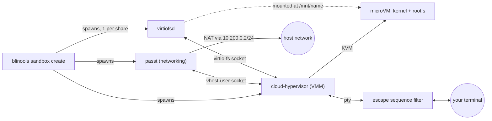

# Sandbox Architecture

This document describes how sandboxes are built.

## Architecture

Each sandbox is a Linux microVM. `blinools sandbox create` acts as an
orchestrator. It spawns a small set of helper processes and wires them
together over local Unix sockets, then hands control of the VM's console to
your terminal.

- **[Cloud Hypervisor](https://github.com/cloud-hypervisor/cloud-hypervisor)**
  is the VMM. It boots your configured `kernel` against a disk built from
  `rootfs`, using KVM for hardware virtualization.
- **[passt](https://passt.top)** provides user-mode networking over a vhost-user socket.
  The guest always gets the static address `10.200.0.2/24` with gateway `10.200.0.1`, NAT'd out to the host's network.
  Custom DNS servers can be pushed to the guest via the `dns` config option.
- **[virtiofsd](https://gitlab.com/virtio-fs/virtiofsd)** creates one instance per
  configured share and exposes a host directory to the guest over virtio-fs.
  Each share is mounted automatically at boot at `/mnt/<name>` via a kernel
  command line option, so nothing needs to run inside the guest to pick it up.
  This only happens if you are using `systemd`.
- **Disk overlay**: `rootfs` is treated as a read-only backing image and is
  never modified. On first run, blinools creates a writable qcow2 overlay in
  the sandbox's [state directory](#on-disk-layout). All writes made inside
  the guest land in that overlay and persist across restarts.
  `--recreate` discards this overlay and starts clean.
- **Console filter**: the guest console is not attached to your terminal directly. blinools puts a
  pty in between and filters what the guest writes, see
  [Console and your terminal](#console-and-your-terminal).
- The kernel command line is always prefixed with
  `console=hvc0 root=/dev/vda rw systemd.hostname=<name>`.
  `console` and `root` can't be overridden via `kernel_cmdline`.

### Console and your terminal

The guest gets a real terminal, and you get a normal shell, but the two are not wired straight
together. blinools allocates a pty, gives the hypervisor the slave side and keeps the master, then
filters problematic escape sequences on their way to your terminal emulator.

### Shares and file ownership

Shares are read-write unless you ask for `ro`, which means the guest can rewrite anything it can see.

virtiofsd is told to squash every guest UID and GID onto the user that started the sandbox, so the
guest cannot express any ownership on the host beyond what that user already has. In the other
direction every host UID and GID shows up in the guest as `guest_uid` / `guest_gid` (`1000` by
default), so shared files stay writable for the guest's normal user.

### On-disk layout

| Path | Contents | Lifetime |
| --- | --- | --- |
| `$XDG_RUNTIME_DIR/blinools/<name>/` (or `/run/user/<uid>/blinools/<name>/`) | Cloud Hypervisor API socket, passt socket, virtiofsd sockets, log files | While the sandbox is running, cleaned up on shutdown / delete |
| `$XDG_RUNTIME_DIR/blinools/<name>.lock` | Empty file, locked while blinools works on that sandbox | Until the sandbox is shutdown |
| `$XDG_STATE_HOME/blinools/<name>/` (or `~/.local/state/blinools/<name>/`) | The qcow2 disk overlay holding everything written inside the guest | Persists across restarts, until `sandbox delete` or `--recreate` or `--delete-after-shutdown` |
