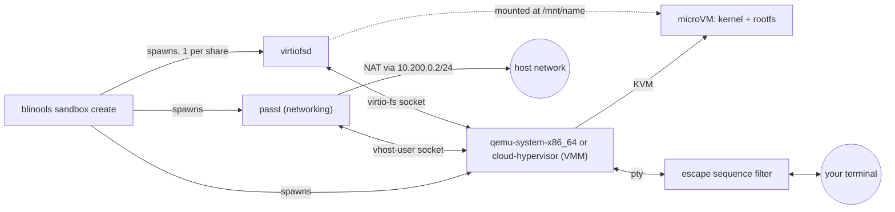

# Sandbox Architecture

This document describes how sandboxes are built.

## Architecture

Each sandbox is a Linux microVM. `blinools sandbox create` acts as an
orchestrator. It spawns a small set of helper processes and wires them
together over local Unix sockets, then hands control of the VMs console to
your terminal.

- **VMM**: [QEMU](https://www.qemu.org/) (`qemu-system-x86_64`) is the VMM by
  default (`hypervisor = "Qemu"`). [Cloud
  Hypervisor](https://github.com/cloud-hypervisor/cloud-hypervisor) can be
  used instead with `hypervisor = "CloudHypervisor"`. The chosen VMM boots
  your configured `kernel` against a disk built from `rootfs`, using KVM for
  hardware virtualization, and is controlled over a local socket (QEMU QMP
  socket, or Cloud Hypervisor API socket).
- **[passt](https://passt.top)**: Provides user-mode networking over a vhost-user socket.
  The sandbox always gets the static address `10.200.0.2/24` with gateway `10.200.0.1`, NAT'd out to the hosts network.
  Custom DNS servers can be pushed to the sandbox via the `dns` config option.
- **[virtiofsd](https://gitlab.com/virtio-fs/virtiofsd)**: Creates one instance per
  configured share and exposes a host directory to the sandbox over virtio-fs.
  Each share is mounted automatically at boot at `/mnt/<name>` via a kernel
  command line option, so nothing needs to run inside the sandbox to pick it up.
  The automatic mounting only happens if you are using `systemd`.
- **Disk overlay**: `rootfs` is treated as a read-only backing image and is
  never modified. On the first run, `blinools` creates a writable qcow2 overlay in
  the sandboxs [state directory](#on-disk-layout). All writes made inside
  the sandbox land in that overlay and persist across restarts.
  `--recreate` discards this overlay and starts clean.
- **Resource confinement**: Linux cgroups v2 is used to limit CPU, memory, and pids
  for the VMM and its helper processes (passt, virtiofsd). CPU is capped to
  the configured `cpus`, memory to `memory_mb` plus a 256 MB overhead with
  swap disabled, and pids to `1024`. This currently only works if
  `user.slice/user-<uid>.slice/user@<uid>.service` already exists under
  `/sys/fs/cgroup` (created by systemd when your user session starts) and
  `blinools` can create a `blinools.slice` subgroup under it.
  A warning will be logged if `blinools` can't create the cgroup.
- **Console filter**: The sandbox console is not attached to your terminal directly. `blinools` puts a
  pty in between and filters what the sandbox writes, see
  [Console and your terminal](#console-and-your-terminal).
- The kernel command line is always prefixed with
  `console=hvc0 root=/dev/vda rw systemd.hostname=<name>`.
  `console` and `root` can't be overridden via `kernel_cmdline`.

### Console and your terminal

The sandbox gets a real terminal, and you get a normal shell, but the two are not wired straight
together. `blinools` allocates a pty, gives the hypervisor the slave side and keeps the master, then
filters problematic escape sequences on their way to your terminal emulator.

### Shares and file ownership

### Shares and file ownership

[virtiofsd](https://gitlab.com/virtio-fs/virtiofsd) is used to share host directories into the sandbox.
Ene instance is spawned per configured share, exposing that share's `host_dir` to the sandbox over `virtio-fs`.
Shares are read-write by default unless you set `ro` via the command line or set the `read_only` field to `true` in the config file.

`virtiofsd` is also told to squash every sandbox `UID` and `GID` onto the user that created / started the sandbox.
The sandbox cannot express any ownership on the host beyond what that user already has.
In the other direction (host to sandbox) every host `UID` and `GID` shows up in the sandbox as `sandbox_user_uid` / `sandbox_user_gid` (`1000` by default).

`read_only_paths` and `hidden_paths` are an additional mechanism to limit what a sandbox can see in a share. They work on subpaths inside the share instead of the whole share.
Both are implemented with mount namespaces on the host.
This means that a read-only or hidden file or directory in the sandbox is genuinely read-only or hidden on the host too.
To be precise, they are read-only / hidden in the created mount namespace of the `virtiofsd` process.

Before `virtiofsd` is started, `blinools` unshares a fresh user, mount and network
namespace for it and makes `/` private and recursive, so none of these mounts are visible outside
that one process:

- Paths in `read_only_paths` are bind-mounted onto themselves and remounted read-only, leaving the
  rest of the share writable. This is only done when the share itself isn't already read-only.
  If it is already configured read-only, then the whole `host_dir` gets bind-mounted onto itself and then remounted as read-only.
- Paths in `hidden_paths` are replaced but not actually removed / replaced.
  A directory gets covered with an empty, read-only `tmpfs`.
  A file gets bind-mounted over itself with an empty file.
  The paths still exist and are still visible to the sandbox, they are just empty.

### On-disk layout

| Path | Contents | Lifetime |
| --- | --- | --- |
| `$XDG_RUNTIME_DIR/blinools/<name>/` (or `/run/user/<uid>/blinools/<name>/`) | Hypervisor control socket (QEMU QMP socket or Cloud Hypervisor API socket), passt socket, virtiofsd sockets, log files | While the sandbox is running, cleaned up on shutdown / delete |
| `$XDG_RUNTIME_DIR/blinools/<name>.lock` | Empty file, locked while blinools works on that sandbox | Until the sandbox is shutdown |
| `$XDG_STATE_HOME/blinools/<name>/` (or `~/.local/state/blinools/<name>/`) | The qcow2 disk overlay holding everything written inside the guest | Persists across restarts, until `sandbox delete` or `--recreate` or `--delete-after-shutdown` |
